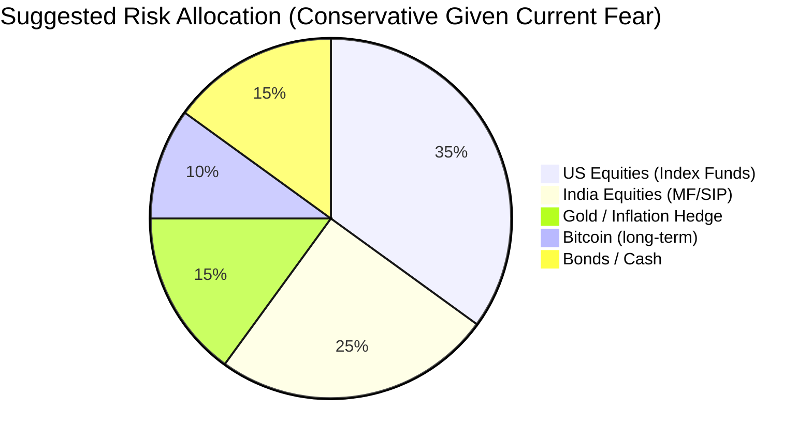

# 📊 Daily Market Analysis — 2026-03-26

> [!quote] Today in One Line
> Markets under pressure everywhere — US correction deepens on oil/tariffs, crypto in extreme fear, India closed for Ram Navami; but every past correction has recovered.

---

## 🌡️ Market Pulse

> [!abstract]- Sentiment Overview
> | Market | 🔴 Bearish | 🟡 Neutral | 🟢 Bullish | Reason |
> |---|---|---|---|---|
> | **US Equities** | ✓ | | | S&P slipped again on oil prices; -1.04% today |
> | **India Equities** | | ✓ | | Market closed (Ram Navami); last close +1.72% |
> | **Crypto** | ✓ | | | Fear & Greed at 14 — Extreme Fear |
> | **Global Macro** | ✓ | | | 10-yr yield at 4.38%, oil elevated, tariffs at 14.3% |

---

## 📈 Index Snapshot

| Index | Today | 1 Week Ago | 1 Month Ago | YTD % | Trend |
|---|---|---|---|---|---|
| S&P 500 | 6,523 | ~6,590 | ~6,800 | ~-4% | ↓ |
| Nasdaq | ~20,200 | ~20,500 | ~21,200 | ~-6% | ↓ |
| Nifty 50 | 23,306 *(Mar 25)* | ~22,900 | ~22,500 | ~+3.6% | → |
| Sensex | ~76,800 *(est)* | — | — | — | → |
| Bitcoin (BTC) | $70,000 | — | — | — | ↓ |
| Ethereum (ETH) | $2,175 | — | — | ↓ | ↓ |
| Gold ($/oz) | $4,400 | ~$4,410 | ~$4,200 | ~+5% | ↑ |
| USD/INR | ₹94.11 | — | — | — | → |
| 10-Yr US Yield | 4.38% | ~4.30% | ~4.25% | ↑ | ↑ |

---

## 📊 Historical Comparison — Auto-Charts

> [!info] These charts auto-update as you add more daily entries. Only one entry exists today — charts will become meaningful after a few more days of analysis.

### 🇮🇳 Nifty 50

```dataviewjs
const pages = dv.pages('"Finance 📈🏦💲/Daily Market Analysis"')
  .where(p => p.type === "daily-market-analysis" && p.nifty_close > 0)
  .sort(p => p.date, "asc")
  .slice(-8);

const labels = pages.map(p => p.date?.toString()?.slice(5, 10) ?? "").array();
const values = pages.map(p => p.nifty_close).array();

const chart = {
  type: "line",
  data: {
    labels,
    datasets: [{
      label: "Nifty 50",
      data: values,
      borderColor: "#f97316",
      backgroundColor: "rgba(249,115,22,0.08)",
      borderWidth: 2,
      pointRadius: 4,
      fill: true,
      tension: 0.3
    }]
  },
  options: {
    plugins: { legend: { display: false } },
    scales: { y: { beginAtZero: false } }
  }
};
window.renderChart(chart, this.container);
```

### 🇺🇸 S&P 500

```dataviewjs
const pages = dv.pages('"Finance 📈🏦💲/Daily Market Analysis"')
  .where(p => p.type === "daily-market-analysis" && p.sp500_close > 0)
  .sort(p => p.date, "asc")
  .slice(-8);

const labels = pages.map(p => p.date?.toString()?.slice(5, 10) ?? "").array();
const values = pages.map(p => p.sp500_close).array();

const chart = {
  type: "line",
  data: {
    labels,
    datasets: [{
      label: "S&P 500",
      data: values,
      borderColor: "#3b82f6",
      backgroundColor: "rgba(59,130,246,0.08)",
      borderWidth: 2,
      pointRadius: 4,
      fill: true,
      tension: 0.3
    }]
  },
  options: {
    plugins: { legend: { display: false } },
    scales: { y: { beginAtZero: false } }
  }
};
window.renderChart(chart, this.container);
```

### ₿ Bitcoin (USD)

```dataviewjs
const pages = dv.pages('"Finance 📈🏦💲/Daily Market Analysis"')
  .where(p => p.type === "daily-market-analysis" && p.btc_price > 0)
  .sort(p => p.date, "asc")
  .slice(-8);

const labels = pages.map(p => p.date?.toString()?.slice(5, 10) ?? "").array();
const values = pages.map(p => p.btc_price).array();

const chart = {
  type: "line",
  data: {
    labels,
    datasets: [{
      label: "BTC (USD)",
      data: values,
      borderColor: "#f59e0b",
      backgroundColor: "rgba(245,158,11,0.08)",
      borderWidth: 2,
      pointRadius: 4,
      fill: true,
      tension: 0.3
    }]
  },
  options: {
    plugins: { legend: { display: false } },
    scales: { y: { beginAtZero: false } }
  }
};
window.renderChart(chart, this.container);
```

### 📊 Multi-Asset % Change (from first entry)

```dataviewjs
const pages = dv.pages('"Finance 📈🏦💲/Daily Market Analysis"')
  .where(p => p.type === "daily-market-analysis" && p.nifty_close > 0)
  .sort(p => p.date, "asc")
  .slice(-8)
  .array();

if (pages.length < 2) {
  dv.paragraph("*Entry #1 recorded — this chart will show relative % performance once more daily entries exist.*");
} else {
  const labels = pages.map(p => p.date?.toString()?.slice(5, 10) ?? "");
  const base = pages[0];
  const pct = (arr, key) => arr.map(p => p[key] > 0 ? +((p[key] - base[key]) / base[key] * 100).toFixed(2) : null);

  const chart = {
    type: "line",
    data: {
      labels,
      datasets: [
        { label: "Nifty 50", data: pct(pages, "nifty_close"), borderColor: "#f97316", borderWidth: 2, pointRadius: 3, fill: false, tension: 0.3 },
        { label: "S&P 500",  data: pct(pages, "sp500_close"),  borderColor: "#3b82f6", borderWidth: 2, pointRadius: 3, fill: false, tension: 0.3 },
        { label: "BTC",      data: pct(pages, "btc_price"),    borderColor: "#f59e0b", borderWidth: 2, pointRadius: 3, fill: false, tension: 0.3 },
        { label: "Gold",     data: pct(pages, "gold_price"),   borderColor: "#a3a3a3", borderWidth: 2, pointRadius: 3, fill: false, tension: 0.3 },
      ]
    },
    options: {
      plugins: { legend: { display: true } },
      scales: { y: { title: { display: true, text: "% Change from first entry" } } }
    }
  };
  window.renderChart(chart, this.container);
}
```

---

## 🇺🇸 US Opportunities

> [!success] Top Picks

| Opportunity | Why Now (Plain English) | Risk | Guru Take |
|---|---|---|---|
| **Tech / AI** | Earnings growing 28% but stocks have dropped — you're getting a discount on a fast-growing business. Lowest price-for-growth of any sector. | 🟡 Med | Lynch: you understand AI. Buffett: fair price for a great business |
| **Semiconductors** | Chips are to AI what steel was to the industrial revolution. Global chip sales hitting $1 trillion this year (+30%). BofA identified 6 top stocks. | 🟡 Med | Dalio: secular growth trend regardless of cycle |
| **Industrials** | Government just passed $130B in tax cuts for manufacturing companies. AI needs physical infrastructure — data centers, power, factories. | 🟡 Med | Kiyosaki: real assets, real cash flow |
| **Healthcare** | Regulators stopped threatening drug companies. Stock prices haven't recovered yet — meaning you can still buy cheap before others notice. | 🟢 Low | Graham: margin of safety, beaten-down sector |
| **S&P 500 (broad)** | Down 10%+ from peak = official "correction." Every single correction in history has recovered to new highs. This is a DCA (monthly investment) window. | 🟢 Low | Buffett: buy when others are fearful |

> [!warning] Watch But Don't Jump Yet
> - **Energy (Devon Energy / SLB):** Very cheap by valuation, but oil price direction unclear. Watch oil for 2 more weeks before entering.
> - **European equities:** Cheaper than US but reforms are slow. Good for diversification, not urgency.

> [!danger] Avoid Right Now
> - **Leveraged/inverse ETFs:** Wrong time to be using 2x or 3x funds in a volatile correction.
> - **High-growth speculative tech (no profits):** Rising yields (4.38%) punish these hardest.

---

## 🇮🇳 India Opportunities

> [!success] Top Picks

| Opportunity | Why Now (Plain English) | Risk | Best Account |
|---|---|---|---|
| **Choice Nifty 50 Index Fund NFO** ⚠️ Closes April 2 | A brand new low-cost fund that tracks India's top 50 companies. "New Fund Offer" = limited window to join at the starting price. | 🟢 Low | NRE (tax-free) |
| **Choice Nifty Next 50 Index Fund NFO** ⚠️ Closes April 2 | Same idea but tracks companies ranked 51–100 — the ones most likely to graduate into the Nifty 50. Higher growth potential. | 🟡 Med | NRE (tax-free) |
| **Start / increase SIP** | Nifty at 23,306 is fair value (PE ratio matches 3-year average). Not cheap, not expensive — a sensible regular entry point. | 🟢 Low | NRE |
| **India ETFs (INDA, PIN)** | US-listed funds that hold Indian stocks. Invest in USD without needing to transfer to India. Analysts call 2026 a breakout year for India. | 🟡 Med | US brokerage |

> [!tip] NRI Corner
> - Your **IDFC First NRE account** is the right vehicle for all India MF investments — interest is tax-free in India and you can bring money back to the US with zero restrictions.
> - The **NFO closes April 2** — 7 days away. If you want in, initiate the investment this week.
> - Nifty analyst targets: **28,500–29,300 by Dec 2026** (Nomura, Reuters) = ~22–26% upside from today's 23,306.

---

## ₿ Crypto

> [!success] Top Picks

| Coin / Sector | Why Now (Plain English) | Risk | Notes |
|---|---|---|---|
| **Bitcoin (BTC) — accumulate** | At $70K with Fear & Greed at 14 (Extreme Fear) — historically one of the best buying signals. "Buy when others are fearful." Not a short-term trade; think 3–5 years. | 🔴 High | Buffett rule applied to crypto: buy fear |
| **Ethereum (ETH) — watch** | Dangerously close to $2,000 — a key support level. If it holds, strong bounce possible. If it breaks, could fall further. Wait for stability. | 🔴 High | Don't catch a falling knife |

> [!warning] Crypto Pulse Today
> **Fear & Greed: 14 — Extreme Fear** &nbsp;|&nbsp; **BTC Dominance: 56.6%** &nbsp;|&nbsp; **Total Market Cap: $2.52T**
>
> What this means: A score of 14 means almost everyone is scared and selling. Historically, extreme fear = good long-term entry zone. But it can stay fearful for weeks. Only invest what you won't need for years.

> [!danger] Avoid
> - **Altcoins (small coins):** When BTC dominance is high (56.6%), money is flowing INTO Bitcoin, not altcoins. Altcoins underperform during these periods.
> - **Leverage/margin trading:** Extreme fear = extreme volatility. Leveraged positions get liquidated fast.

---

## 🌍 Global Macro

> [!abstract] The Big Picture

| Theme | What It Means For You | What To Do |
|---|---|---|
| **US Tariffs at 14.3%** | Companies importing goods pay more → prices rise or profits fall → stocks slide | Favor domestic US companies, avoid import-heavy retailers |
| **10-Yr Yield at 4.38% (rising)** | Borrowing costs going up. Growth stocks hurt most. But savers benefit — high-yield savings/bonds paying well. | Consider TIPS or I-bonds for safe portion of savings |
| **Gold at $4,400 (+5% YTD)** | Investors nervous = they buy gold as a "safe haven." Gold rising = market fear signal. | If you don't own any gold exposure, a small allocation (5–10%) acts as insurance |
| **USD/INR at ₹94.11** | Rupee has weakened vs dollar. Good for NRIs sending money to India — your dollars buy more rupees. | Good time to transfer USD → INR for India investments |
| **Geopolitical risk (Iran/oil)** | Oil prices elevated, disrupting global trade. Temporary but creates volatility. | Don't panic-sell; volatility is the admission price for returns |



---

## 📅 Running Scoreboard

```dataview
TABLE WITHOUT ID
  date AS "📅 Date",
  nifty_close AS "🇮🇳 Nifty",
  sp500_close AS "🇺🇸 S&P",
  btc_price AS "₿ BTC",
  gold_price AS "🪙 Gold ($)",
  usd_inr AS "💱 USD/INR",
  sentiment AS "🌡️ Mood"
FROM "Finance 📈🏦💲/Daily Market Analysis"
WHERE type = "daily-market-analysis" AND nifty_close > 0
SORT date DESC
LIMIT 12
```

---

## ✅ Action Items

> [!todo] This week
> - [ ] Check Choice Nifty 50 NFO — closes April 2. Decide yes/no before then.
> - [ ] Check Choice Nifty Next 50 NFO — same deadline.
> - [ ] Watch ETH at $2,000 support level — hold or break?
> - [ ] Consider starting/increasing SIP given fair value entry.
> - [ ] Check if S&P 500 bounces or continues correction next session.

---

## 🔍 My Review *(fill in after reading)*

> [!example]- Rate Today's Analysis

| Question | Answer |
|---|---|
| How actionable were the recommendations? | /5 |
| Anything confusing or unclear? | |
| What was missing? | |
| Did last week's top pick play out? | First entry — no prior baseline |
| Overall score | /5 |

---

## 📖 Plain English Glossary

> [!info]- Every technical term used today — click to expand

| Term | What It Actually Means |
|---|---|
| **P/E Ratio** | Price-to-Earnings. You pay $20 for every $1 of company profit at P/E 20. Lower generally means cheaper — but only compare companies in the same industry. |
| **P/E-to-Growth (PEG)** | Takes the P/E ratio and adjusts it for how fast earnings are growing. Tech sector has P/E of 27 but earnings growing 28% — so PEG is nearly 1. Under 1 = potentially undervalued even if the P/E looks high. |
| **Correction** | When a market falls 10–20% from its recent high. Normal, happens every 1–2 years. Every single correction in S&P 500 history has eventually recovered to new highs. |
| **DCA (Dollar-Cost Averaging)** | Investing a fixed amount every month regardless of price. When prices drop you automatically buy more shares. Removes the stress of "timing the market." |
| **SIP** | Systematic Investment Plan — India's version of DCA. Auto-debit a fixed rupee amount monthly into a mutual fund. Works even while you sleep. |
| **NFO (New Fund Offer)** | A new mutual fund opening for investment for a limited time window — like an IPO for a fund. After it closes, you can still invest but at daily market rates. |
| **Index Fund** | A fund that simply copies an index (Nifty 50, S&P 500). Extremely cheap to run. Historically beats ~80% of actively managed funds over 10+ years. |
| **ETF (Exchange-Traded Fund)** | Like an index fund, but it trades on the stock exchange like a stock — you can buy or sell any time during market hours. |
| **Expense Ratio** | The silent annual fee a fund charges. 0.03% on ₹10 lakh = ₹300/year. 1.5% = ₹15,000/year. Looks tiny but compounds enormously over 25 years. |
| **10-Year Treasury Yield** | The interest rate the US government pays to borrow money for 10 years. When this rises, it makes bonds more attractive vs stocks — so money flows out of stocks. Currently 4.38%. |
| **Fear & Greed Index** | 0–100 score of how scared or excited investors are. Today's score is 14 — Extreme Fear. Historically, extreme fear = good long-term buying zone (everyone is selling, prices are lower). |
| **BTC Dominance** | Bitcoin's share of total crypto market value. At 56.6%, more than half of all crypto money is in Bitcoin. This means altcoins are losing — investors prefer the "safer" crypto. |
| **NRE Account** | Non-Resident External. Park your US earnings here in INR. Interest earned is completely tax-free in India. You can transfer money back to the US at any time with no limits. |
| **NRO Account** | Non-Resident Ordinary. For money earned inside India. Interest is taxed. Sending money back to the US is capped at $1 million per year. |
| **Support Level** | A price where a stock/coin has bounced back multiple times. ETH at $2,000 is a support level — if it breaks below, the next floor is much lower. |
| **Tariff** | A tax charged on imported goods. The US now charges ~14.3% tax on imports (vs 2% in 2025). Companies absorbing these costs earn less profit → stock prices fall. |
| **Margin of Safety (Graham)** | Buying something for significantly less than what it's truly worth. Like buying a $100 item on 30% sale. Protects you if your estimate of its value turns out to be slightly wrong. |
| **Fiscal Stimulus** | Government spending to boost the economy. The US passed $130B in business tax cuts — money that flows directly into corporate profits and investment. |
| **Safe Haven** | Assets people run to when markets are scary — gold, US Treasury bonds, Japanese yen. Gold at $4,400 signals significant fear in global markets. |

---

*Disclaimer: Educational analysis based on public information — not professional financial advice. Do your own research before investing.*
